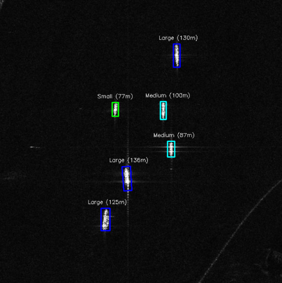

# 🛰️ Maritime Ship Detection & Intelligence System (SAR)

## 📋 Project Overview
This project is an automated pipeline for detecting, classifying, and analyzing maritime vessels using **Synthetic Aperture Radar (SAR)** imagery logic. Unlike optical sensors, this system operates on intensity-based data, simulating real-world monitoring capabilities used in the **NewSpace sector**.

The system processes satellite imagery to provide actionable intelligence: ship location, heading (orientation), estimated physical size, and classification.

## 🚀 Key Features
* **Computer Vision Pipeline:** Gaussian noise reduction (despeckling) and Adaptive Thresholding for robust segmentation.
* **Pose Estimation:** Utilizing `cv2.minAreaRect` to determine the precise heading (orientation) of vessels.
* **Physical Analysis:** Implementing **Ground Sample Distance (GSD)** calibration (2.5m/px) to estimate real-world dimensions.
* **Automated Classification:** Logic-based categorization of vessels into *Small*, *Medium*, and *Large* classes.
* **Reporting:** Automatic generation of a mission report (CSV) ready for database integration.

## 🛠️ Tech Stack
* **Python 3.10+**
* **OpenCV:** Image processing and contour analysis.
* **NumPy:** Matrix operations and geometry calculations.
* **Pandas:** Data structuring and export.
* **Matplotlib:** Visualization of tactical maps.

## 📊 Methodology
1.  **Preprocessing:** Application of Gaussian Blur to mitigate speckle noise inherent in radar data.
2.  **Segmentation:** Binary thresholding to isolate high-backscatter targets (ships) from the background.
3.  **Morphological Operations:** Dilation to merge disjointed ship parts into coherent objects.
4.  **Analysis:** Extraction of geometric properties to calculate length and heading.
5.  **Intelligence Output:** Visual overlay with bounding boxes and a structured report.

## 📈 Sample Results
Here is the output of the classification pipeline. Colors indicate vessel size (Green=Small, Yellow=Medium, Red=Large).

*Sample Mission Report Data:*
| ID | Category | Length (m) | Heading (deg) |
|----|----------|------------|---------------|
| 0  | Small    | 45m        | 86            |
| 1  | Medium   | 110m       | 90            |
| 2  | Large    | 180m       | 88            |

## 👤 Author
**[Jakub Czupik]**
